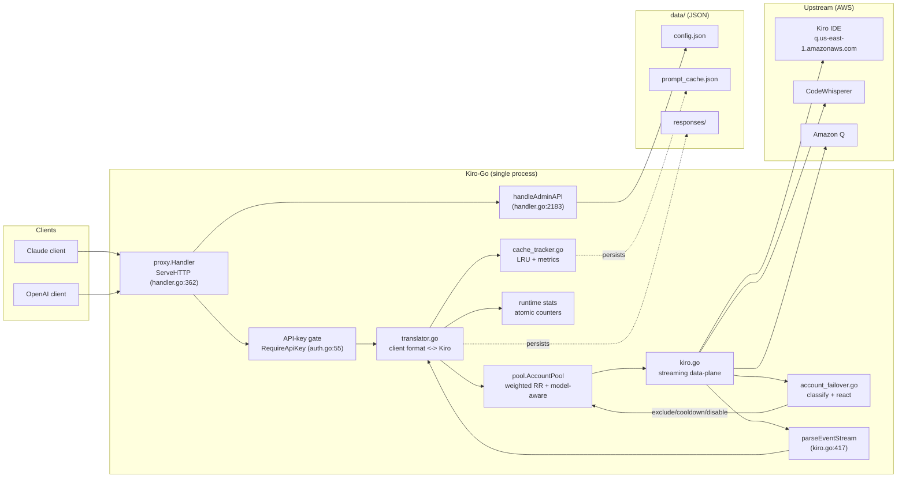
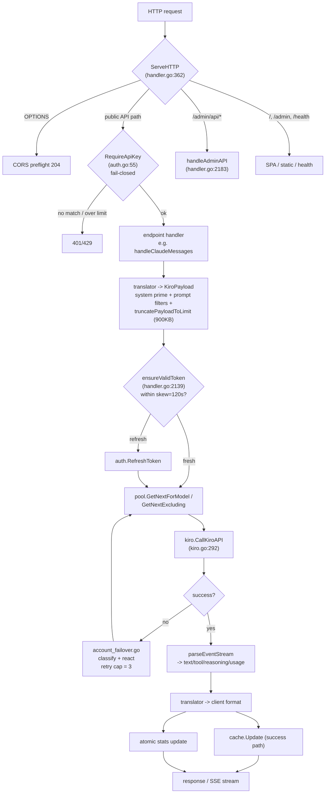
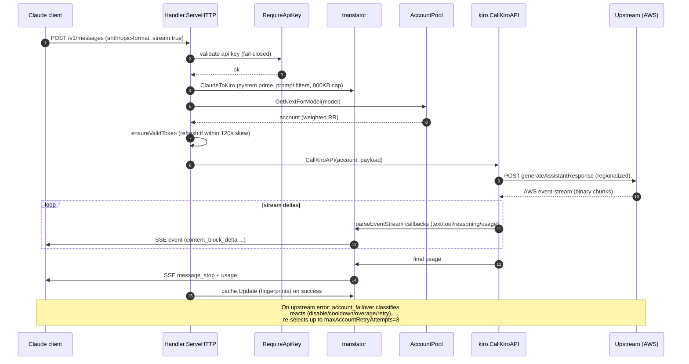
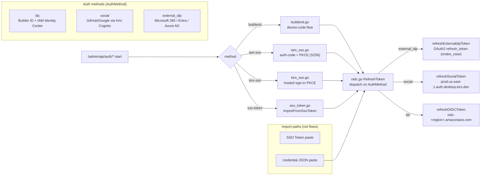
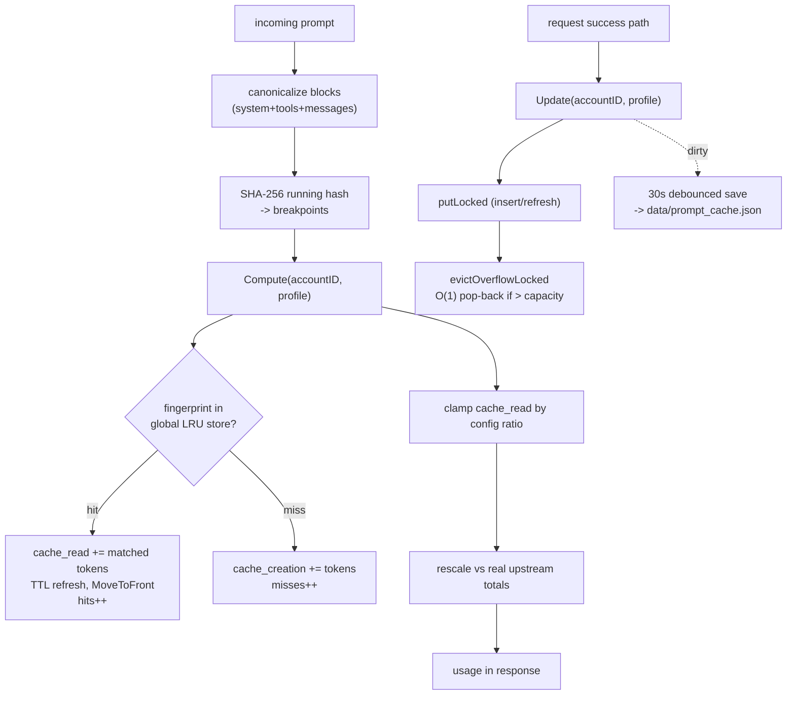
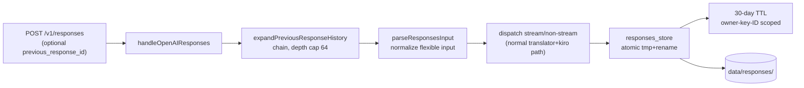
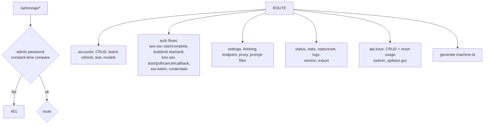

# Kiro-Go — System Architecture

> **Audience:** Contributors who need to understand how requests flow, how the pool fails over, how SSO works, and how cache/responses are accounted.
> **Companion docs:** [Codebase Summary](codebase-summary.md) (the map), [Code Standards](code-standards.md) (the rules), [Design Guidelines](design-guidelines.md) (where to extend).

Diagrams use **Mermaid v11** syntax (```` ```mermaid ```` fences). File/line references are accurate to the v1.1.2 codebase.

## 1. High-Level Component View

Kiro-Go is a single process: one `http.Server`, one `AccountPool`, one `proxy.Handler` that owns the router, translator, upstream clients, cache tracker, and stats.



Key invariants:

- `pool` does **not** own credentials; it reads `config.Account` snapshots and records per-account runtime state (success/error, cooldown, overage, model set).
- The cache tracker is **accounting-only** (it reports `cache_*` tokens; it never returns a cached response).
- `http.Server.WriteTimeout=0` intentionally, so SSE streams are not server-killed (`main.go`).

## 2. Request Lifecycle (public API)

The single router is `ServeHTTP` (`proxy/handler.go:362`). It handles CORS, short-circuits `OPTIONS`, dispatches public API endpoints, then admin/health routes.



### Sequence: a streaming `/v1/messages` request



## 3. Account Pool & Failover

`pool/account.go` holds the process-wide `AccountPool` (`GetPool()`). Selection is weighted round-robin that skips unusable accounts.

```mermaid
flowchart TD
    SEL["GetNextForModel / GetNextExcluding"] --> CHK{"for each candidate"}
    CHK -->|excluded by caller| SKIP["skip"]
    CHK -->|in cooldown| SKIP
    CHK -->|near expiry (&lt;120s skew)| SKIP
    CHK -->|quota-blocked / disabled| SKIP
    CHK -->|doesn't serve model| SKIP
    CHK -->|usable| PICK["return account (weighted)"]

    PICK --> CALL["dispatch request"]
    CALL --> RES{"upstream result"}
    RES -->|success| SUCC["RecordSuccess<br/>UpdateToken/UpdateStats"]
    RES -->|429 / quota| Q429["disable account"]
    RES -->|402 / overage| OVR["refresh overage switch<br/>(kiro_overage.go)"]
    RES -->|suspension / profile-unavailable| COOL["soft cooldown"]
    RES -->|auth error| AUTH["retry (up to 3)"]
    RES -->|other| RETRY["retry next endpoint/account"]

    SUCC --> SELN["next request"]
    Q429 --> SELN
    OVR --> SELN
    COOL --> SELN
    AUTH --> CALL
    RETRY --> SELN
```

Retry/selection specifics:

- Pre-dispatch token freshness: `ensureValidToken` (`handler.go:2139`) refreshes if `now > ExpiresAt - tokenRefreshSkewSeconds` (`tokenRefreshSkewSeconds=120`, `handler.go:22`).
- Retry cap: `maxAccountRetryAttempts=3` (`account_failover.go:10`) — enforced in four dispatch loops (`handler.go:897,1467,1664,2045`).
- Upstream endpoint fallback: three ordered endpoints in `kiroEndpoints` (`kiro.go:32`): Kiro IDE, CodeWhisperer, Amazon Q.
- Profile resolution: `ResolveProfileArn` (`kiro_api.go:260`) probes `defaultKiroProfileRegions=["us-east-1","eu-central-1"]` (`kiro_api.go:95`) with a 24h cooldown for unsupported profiles.
- URL regionalization: `regionalizeURLForRegion` (`kiro_api.go:77`) rewrites `us-east-1` hosts to the profile's region.

## 4. Authentication & SSO Flows

`auth/` implements the credential lifecycle. All flows follow a **Start / Poll** (or Start / Complete) pattern so the admin panel can drive them asynchronously. `RefreshToken` (`auth/oidc.go`) dispatches on `AuthMethod`.



### The five credential paths

1. **AWS Builder ID** (`auth/builderid.go`): device-code flow. Registers an OIDC client (`"Kiro"`) with CodeWhisperer scopes, performs device authorization, polls `/token`.
2. **IAM Identity Center / Enterprise AWS SSO** (`auth/iam_sso.go`): authorization-code + PKCE (S256), `redirect_uri=http://127.0.0.1/oauth/callback`, anti-CSRF `state`.
3. **Hosted Kiro sign-in** (`auth/kiro_sso.go`, ~906 lines): the browser flow the Kiro IDE uses at `app.kiro.dev/signin`. Federates Google, GitHub, **and** enterprise IdPs (Microsoft 365 / Entra ID / Azure AD) behind one PKCE auth-code flow. Two legs, one transient loopback listener on fixed port **3128**.
   - **Social leg** (Google/GitHub): via Cognito; token exchange at `prod.us-east-1.auth.desktop.kiro.dev/oauth/token`.
   - **Enterprise/external IdP leg** (Azure AD): a second OIDC auth-code + PKCE flow directly against the IdP.
   - **Security:** `allowedExternalIdpIssuerSuffixes` (`.microsoftonline.com` / `.us` / `.cn`), `validateExternalIdpEndpoint` (https + non-IP + allow-listed host = SSRF guard), `oidcDiscover` (no redirects). `FeedCallbackURL` lets operators paste the callback URL when the browser can't reach the loopback (remote/container deployments).
4. **SSO Token import** (`auth/sso_token.go`): raw AWS SSO bearer token paste, 7-step `ImportFromSsoToken`, plus `GetUserInfo` and `GenerateAccountID`.
5. **Credential JSON import** (admin handler): paste a JSON blob; the `external_idp` adapter (`docs/superpowers/plans/2026-06-27-credential-json-external-idp-adapter.md`) recognizes Azure AD shapes, validates the IdP endpoint against the allow-list, and routes refresh through `refreshExternalIdpToken`.

> **Provider defaults** when empty: `external_idp -> AzureAD`, `social -> Google`, `idc -> BuilderId`. Canonical `AuthMethod` values are snake_case. The alias `enterprise` maps to `idc` (Kiro Account Manager contract), **not** to `external_idp`.

### Token refresh dispatch (`auth/oidc.go`)

`RefreshToken` switches on `AuthMethod`:

| AuthMethod | Refresh path | Response casing |
|------------|--------------|-----------------|
| `external_idp` | `refreshExternalIdpToken` — OAuth2 `refresh_token` grant | snake_case |
| `social` | `refreshSocialToken` — `prod.us-east-1.auth.desktop.kiro.dev/refreshToken` | camelCase |
| else (`idc`) | `refreshOIDCToken` — `oidc.<region>.amazonaws.com/token` | — |

## 5. Prompt-Cache Accounting

The tracker (`proxy/cache_tracker.go`) mirrors upstream Anthropic prompt caching **to estimate** `cache_creation_input_tokens` / `cache_read_input_tokens`. It does **not** cache responses.



Properties:

- **Global store (cross-account sharing):** `accountID` is ignored by the store — all pooled accounts share entries (they are assumed to be in the same upstream Anthropic org context).
- **TTL:** default 5 min (`defaultPromptCacheTTL`, `cache_tracker.go:18`); max supported 1h. Min cacheable 1024 tokens (4096 for opus).
- **Capacity:** configurable `config.PromptCacheMaxEntries` (default 131072, floor 256) via `container/list` O(1) LRU.
- **Persistence:** `data/prompt_cache.json`, loaded on startup, debounced-write every 30s; expired entries dropped on load.
- **Metrics:** atomic counters `hits`/`misses`/`evictions`/`expirations` exposed via `Stats()` on `/v1/stats`.

## 6. OpenAI Responses Persistence

`/v1/responses` (`proxy/responses_handler.go`) supports `previous_response_id` chaining. Responses are persisted under `data/responses/`.



- **History expansion:** `responses_history.go` walks the `previous_response_id` chain capped at depth 64.
- **Input normalization:** `responses_input.go` `parseResponsesInput` accepts the flexible Responses input field shape.
- **Persistence:** `responses_store.go` writes with atomic tmp + rename, scopes files by owner key + response ID, and applies a 30-day TTL.

## 7. Admin Surface

`handleAdminAPI` (`handler.go:2183`) is a nested router for ~50 admin sub-routes, all gated by `X-Admin-Password` header or `admin_password` cookie (constant-time compare).



## 8. Background Goroutines

`proxy.NewHandler()` starts a small, fixed set of background goroutines. They must not panic the process on transient errors.

| Goroutine | Responsibility |
|-----------|----------------|
| `backgroundRefresh` | Pre-emptively refresh account tokens approaching expiry |
| `backgroundStatsSaver` | Persist runtime stats to `data/` |
| Expired-response purge | Remove `data/responses/` entries past their 30-day TTL |
| Prompt-cache save loop | Debounced 30s flush of `data/prompt_cache.json` |

## 9. Process Bootstrap

See [Codebase Summary §5.1](codebase-summary.md) for the linear bootstrap sequence in `main.go`. The one subtlety worth repeating here: `WriteTimeout=0` is deliberate (SSE), and the timeouts that *do* apply (`ReadHeaderTimeout=30s`, `ReadTimeout=60s`, `IdleTimeout=120s`) are the slowloris guard.
